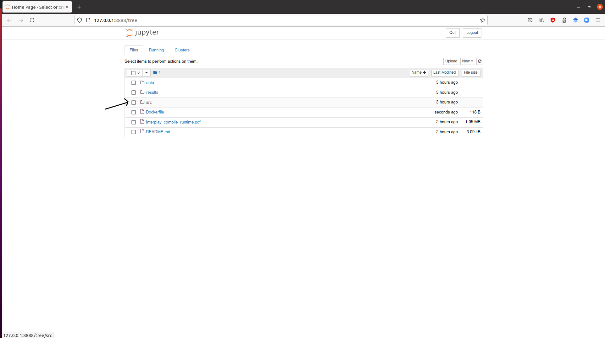

# The Interplay of Compile-time and Run-time Options for Performance Prediction - Companion repository 

This is the companion repository of the SPLC'21 45th submission.

## Organization

Measurements and details about the performances can be consulted in the **data** folder.

Source code can be found in the **src** directory.

The **results** folder contains the results shown in the submission, as well as complementary results.

The submission **Interplay_compile_runtime.pdf** can be consulted in the root directory.

## Our research work in a nutshell

This paper investigates how compile-time options (top, in red on the following picture) can affect software performances (bottom, in black) and how compile-time options (still top, in red) interact with run-time options (bottom, in green).


## Replication

To replicate our work, you have to:
1. Replicate the **measurement process**
2. **Run the code** in order to obtain our results

### Prerequisites

Install [docker](https://docs.docker.com/get-docker/). You can check that docker is working by checking its version (use the command line ```sudo docker --version```) or status (use ```sudo systemctl status docker```).

### 1. Measurement process

In this paper, we measured several performance properties of 4 different software systems (*nodeJS*, *poppler*, *x264*, and *xz*) for multiple run-time and compile-time configurations. 

For each of these system, we provide a docker container to measure its performances:
- for *nodeJS*, please follow this link : https://hub.docker.com/r/anonymicse2021/compile_nodejs
- for *poppler*, please follow this link : https://hub.docker.com/r/anonymicse2021/compile_poppler
- for *x264*, please follow this link : https://hub.docker.com/r/anonymicse2021/compile_x264
- for *xz*, please follow this link : https://hub.docker.com/r/anonymicse2021/compile_xz

For the rest of this part, we will consider x264's container, but the command lines we provide can be adapted to other containers. Note that docker will require administrative rights.

First, pull the container:

`sudo docker pull anonymicse2021/compile_x264`

Run it in interactive mode:

`sudo docker run -it anonymicse2021/compile_x264`

Now you are in the container. You can start the measurement process for x264. **WARNING! Since replicating all the measurements might take a while, we recommend you to stop the process after few minutes (2 or 3 is enough).**

`bash launchMeasures.sh`

To stop the process, just press ctrl + c on your keyboard. Now go to the output folder:

`cd output`

You will see a directory structure similar to the */data/x264/* directory (see also the explanations in *data/README.md*). To make sure that data are stored, just go in the first directory...

`cd 1`

... and display the first file:

`cat original_videos_Gaming_360P_Gaming_360P-56fe.csv`

You can compare it with this file : https://github.com/llesoil/ctime_opt/blob/main/data/x264/1/original_videos_Gaming_360P_Gaming_360P-56fe.csv

The first step is done!

You can `exit` the container.

### 2. Run the code

Now, you have the data. But how to replicate our results?

First, run this container :

`sudo docker run -i -p 8888:8888 anonymicse2021/splc21`

Then, go to the link displayed on your terminal, starting with http://127.0.0.1:8888/?token= like in the following picture:


It will open a new tab on your web navigator, looking like this:



You can now click on the 'src' directory...


... And on the Main notebook, it will open a new tab. Finally, search for "Kernel" -> "Restart and run all", and click, like this :


It will execute all the cells, displaying the different results of the submission (between 5 and 10 minutes).

Check the results of the execution. The second part of the replication is done, you can now kill the process and exit the container.

### To go further

If you want to use our artifact to test new measurements, just follow this process:

1. Measurement process

First, you will have to select your software system. Make sure the software system provide compile-time configuration options as well as run-time configuration options (reading the documentation helps to select the influential configuration options).

Select a dataset of input data (c scripts for a compiler like gcc, databases for a DBMS like SQLite, etc.) and measure the performances of the software system for...
- All inputs
- All compile-time configurations
- All run-time configurations

... to obtain measurements following the structure detailed in the README.md of the data directory (each sub-directory for a compile-configuration, each file for an input).

Copy these files in the docker container, in the data directory, with the name "mySoft" (see https://stackoverflow.com/questions/22907231/how-to-copy-files-from-host-to-docker-container).

2. Execute the code

Run the container as above:

`sudo docker run -i -p 8888:8888 anonymicse2021/splc21`

Create a "mySoft" folder in the results directory, as in the following picture : this directory aims at gathering the results for the new software system mySoft.


Open the main notebook.

In the second cell of code ([2], after the comment 'Import data') of the Main notebook, modify the second line of code ...

`name_systems = ["x264", "xz", "nodejs", "poppler"]`

by adding "mySoft" in the array. The second line of code should look like this : 

`name_systems = ["x264", "xz", "nodejs", "poppler", "mySoft"]`

Execute the notebook as above, and check the "results/mySoft" directory.

Thank you for testing our artifact!

## Contact

If you have any question regarding this research paper or its replication, you can contact me at luc.lesoil@irisa.fr or via github, by creating an issue with your problem.


